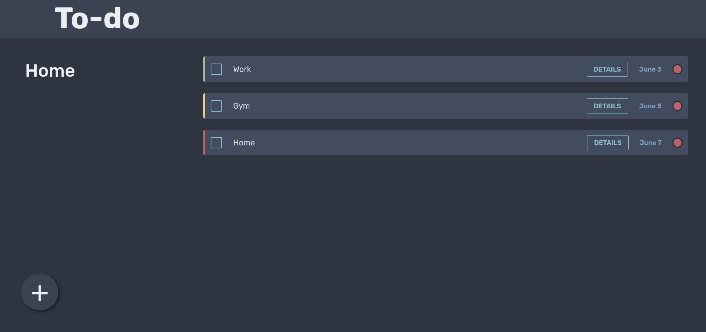

## Todo list

This project is from [The Odin Project](https://www.theodinproject.com/lessons/node-path-javascript-todo-list) curriculum.

It's my take on a todo list using only html, css & js. The notes are stored in local storage and the styling
is in the very aesthetic [NordTheme](https://www.nordtheme.com/)

Originally created 7/12/22